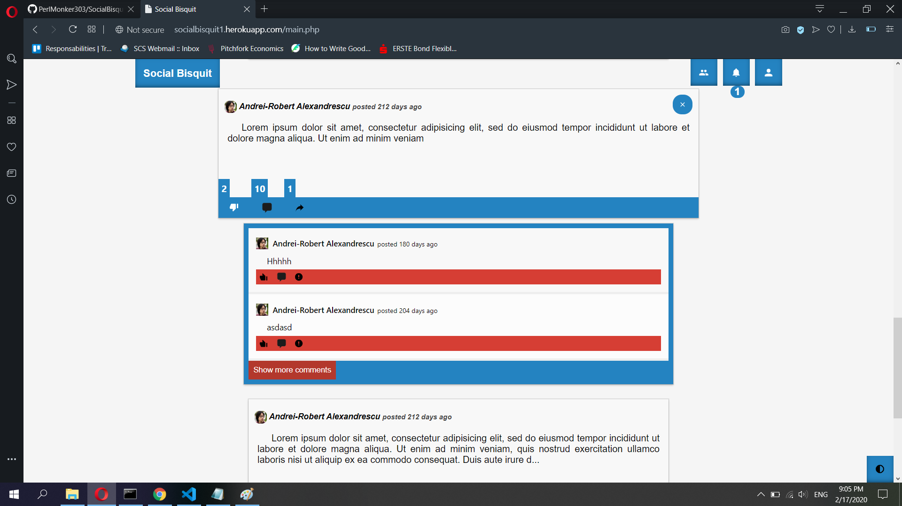

# SocialBisquit1.0
SocialBisquit is an ad-free social-media platform used to connect people from all over the world.
It also serves the purpose of a dating platform, providing users with options to engage with other users and set dates (coming soon).

<h2>Check it out at socialbisquit1.herokuapp.com</h2>
<h4>There is an error when trying to setup your profile at step 2.</h4>

<h3><b>Features:</b></h3>
<ul>
  <li>create an account and setup your profile</li>
  <li>add posts on the main page and see what other user's have on their mind</li>
  <li>interact with other users (like/comment/share their posts)</li>
  <li>bond new relationships (send/recieve friend requests)</li>
  <li>benefit from a fully-fledged notifications system and never miss out</li>
</ul>

<h3>Tech stack:</h3>
<ul>
  Front-End:
  <ul>
    <li>HTML</li>
    <li>CSS</li>
  </ul>
  Back-End:
  <ul>
    <li>Javascript - jQuery, Axios</li>
    <li>PHP</li>
    <li>SQL</li>
  </ul>
  Other:
  <ul>
    <li>Online host provided by Heroku.com</li>
  </ul>
  
</ul>

<h2>Screenshots</h2>

